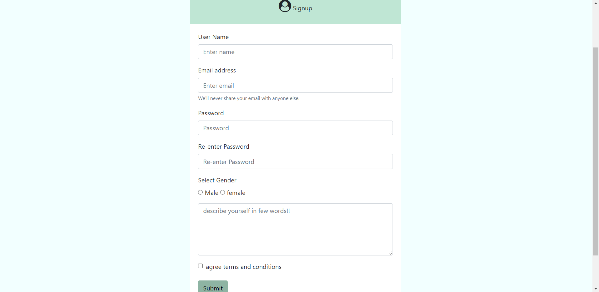

# TechBlog

###### TechBlog is a web application where a user can signup and login to his/her account and can post any blog related to tech and also can see others blog post and can like them.

The technology used for frontend is - ***HTML, css, Js, Bootstrap.***

The Technology used for backend is - ***JSP, Servlet, JDBC.***

server used is - ***apache tomcat***

ide used is - ***Netbeans***

database used is - ***mysql***

*There is a lot of scope of adding new features to the application.*

Scrrenshots of the web application!

